## 1关于本文档的开源协议说明
**您可以自由地：**

**分享** 

- 在任何媒介以任何形式复制、发行本文档

**演绎** 

- 修改、转换或以本文档为基础进行创作。只要你遵守许可协议条款，许可人就无法收回你的这些权利。

**惟须遵守下列条件：**

**署名** 

- 您必须提供适当的证书，提供一个链接到许可证，并指示是否作出更改。您可以以任何合理的方式这样做，但不是以任何方式表明，许可方赞同您或您的使用。

**非商业性使用** 

- 您不得将本作品用于商业目的。

**相同方式共享** 

- 如果您的修改、转换，或以本文档为基础进行创作，仅得依本素材的
授权条款来散布您的贡献作品。

**没有附加限制** 

- 您不能增设法律条款或科技措施，来限制别人依授权条款本已许可的作为。

**声明：**

-  当您使用本素材中属于公众领域的元素，或当法律有例外或限制条款允许您的使用，
则您不需要遵守本授权条款。
未提供保证。本授权条款未必能完全提供您预期用途所需要的所有许可。例如：形象
权、隐私权、著作人格权等其他权利，可能限制您如何使用本素材。

**注意**

- 为了方便用户理解，这是协议的概述. 可以访问网址 https://creativecommons.org/licenses/by-sa/3.0/legalcode 了解完整协议内容.

## 2前言
### 目的
本文档介绍如何将FatFs移植到Huawei LiteOS使用。
### 读者对象
本文档主要适用于Huawei LiteOS Kernel的开发者。
本文档主要适用于以下对象：
- 物联网端软件开发工程师
- 物联网架构设计师

### 符号约定
在本文中可能出现下列标志，它们所代表的含义如下。

     用于警示紧急的危险情形，若不避免，将会导致人员死亡或严重的人身伤害

    用于警示潜在的危险情形，若不避免，可能会导致人员死亡或严重的人身伤害

    用于警示潜在的危险情形，若不避免，可能会导致中度或轻微的人身伤害

     用于传递设备或环境安全警示信息，若不避免，可能会导致设备损坏、数据丢失、设备性能降低或其它不可预知的结果“注意”不涉及人身伤害

| 说明	|		“说明”不是安全警示信息，不涉及人身、设备及环境伤害信息	|

### 修订记录
修改记录累积了每次文档更新的说明。最新版本的文档包含以前所有文档版本的更新
内容。

<table>
	<tr>
	<td>日期</td>
	<td>修订版本</td>
	<td>描述</td>
	</tr>
	<tr>
	<td>2017年2月28日</td>
	<td>1.0</td>
	<td>完成初稿</td>
	</tr>
</table>

## 3概述

### FATFS简介

FatFS是一个为小型嵌入式系统设计的通用FAT(File Allocation Table)文件系统模块,它完全免费开源，具有以下特点：

- Windows兼容的FAT文件系统，

- 代码和工作区占用空间非常小

- 使用标准C语言编写，且独立于I/O层，只需要简单的修改就可以被移植到低成本的微控制器中

- 支持多个存储媒介，有独立的缓冲区，可以对多个文件进行读／写

LiteOS支持FATFS文件系统，本手册以STM32F429ZI芯片为例，介绍基于使用芯片内部flash的FatFS移植过程。

## 4环境准备
基于Huawei LiteOS Kernel开发前，我们首先需要准备好单板运行的环境，包括软件环
境和硬件环境。
硬件环境：

<table>
	<tr>
	<td>所需硬件</td>
	<td>描述</td>
	</tr>
	<tr>
	<td>STM32F4291-DISCO单板</td>
	<td>STM32开发板(芯片型号STM32F429ZIT6)</td>
	</tr>
	<tr>
	<td>PC机</td>
	<td>用于编译、加载并调试镜像</td>
	</tr>
	<tr>
	<td>电源（5v）</td>
	<td>开发板供电(使用Mini USB连接线)</td>
	</tr>
</table>

软件环境：

<table>
	<tr>
	<td>软件</td>
	<td>描述</td>
	</tr>
	<tr>
	<td>Window 7 操作系统</td>
	<td>安装Keil和st-link的操作系统</td>
	</tr>
	<tr>
	<td>Keil(5.21以上版本)</td>
	<td>用于编译、链接、调试程序代码
	uVision V5.21.1.0 MDK-Lite uVersion:5.21a</td>
	</tr>
	<tr>
	<td>st-link_v2_usbdriver</td>
	<td>开发板与pc连接的驱动程序，用户加载及调试程序代码</td>
	</tr>
</table>

**说明**

Keil工具需要开发者自行购买，ST-Link的驱动程序可以从ST官网获取，采用J-Link还
是ST-Link需要根据具体使用的开发板来确定。这里以STM32F429为例，使用ST-Link。

## 5获取Huawei LiteOS 及适配的 FatFs 源码

###step1:获取Huawei LiteOS源码，方法如下：

- 仓库地址是https://github.com/LITEOS/LiteOS_Kernel.git 

- 点击”clone or download”按钮,下载源代码

- 目录结构如下：

###step2:下载FatFs源码：

- LiteOS适配的FatFs源码，网址：http://developer.huawei.com/ict/cn/resource/samplecode?ecologyID=171&productID=256&colname=1&key=FatFs&curPage=1&pageNum=10&isOpen=false

- 如果您想使用最新的FAT源码，也可以在官网下载更新，网址：http://elm-chan.org/fsw/ff/00index_e.html

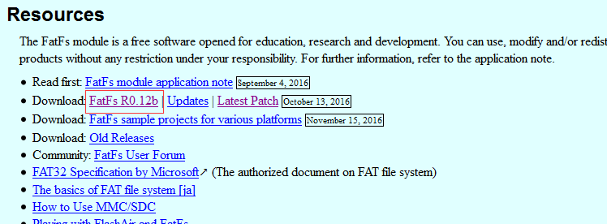

目录结构如下：

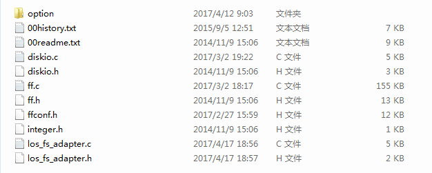

###step3:下载stm32cubef4开发包：

网址：http://www.st.com/content/st_com/en/products/embedded-software/mcus-embedded-software/stm32-embedded-software/stm32cube-embedded-software/stm32cubef4.html

点击“Get Software”按钮下载：

解压后目录结构如下：

获取相关源代码之后，我们可以开始移植工作了，由于STM32F4291-DISCO单板没有外挂的flash设备，我们将使用MCU内部flash进行文件系统操作，使用芯片外部falsh的操作过程与此相同。

## 6如何移植FatFS

本章节描述的内容以stm32cubef4开发包中的flash驱动代码为基础，移植FatFs到LiteOS的STM32F429I_DISCO_KEIL工程中，演示基于使用MCU内部flash进行fatfs移植的过程。

### 添加需要的代码到LiteOS工程中

- STM32F429的源代码工程包含Drivers、应用适配程序以及startup_stm32f429xx.s汇编启动文件。

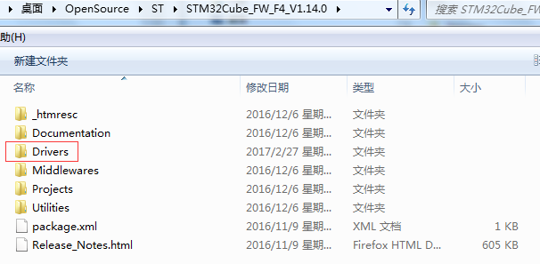

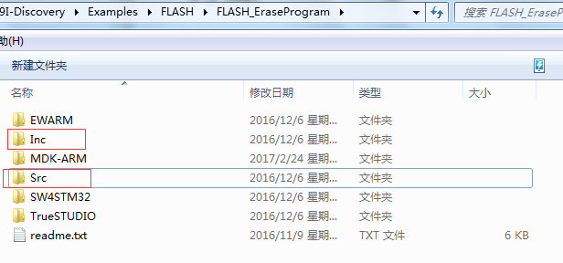

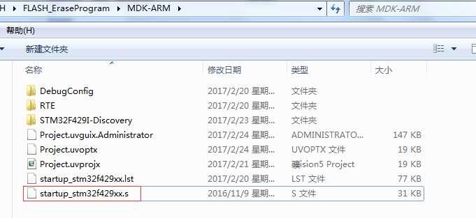

- 在LiteOS顶级目录下创建STM32FXX目录，然后将Drivers目录拷贝到下面

- 创建STM32FXX\stm32f429目录，将inc和src拷贝到下面，并且将startup_stm32f429xx.s也拷贝到stm32f429目录中。

- 创建/thirdparty/FatFs目录,拷贝FatFs源码到该目录下

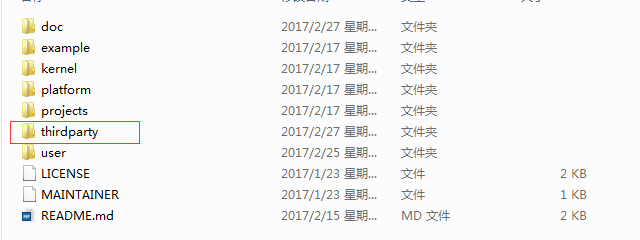

- 在\platform\STM32F429I_DISCO目录下新建los_bsp_flash.c和los_bsp_flash.h文件

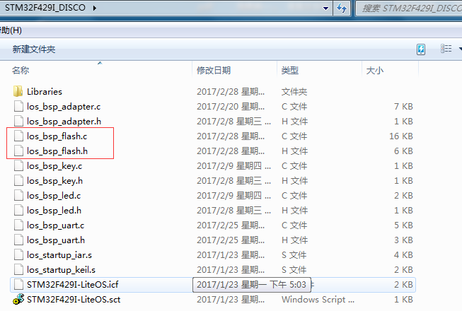

- 在LiteOS工程中新建stm32f4xx及fatfs目录，并添如下代码

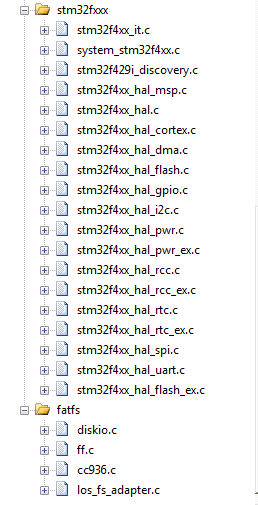

- 在platform/stm32f429i目录下添加los_bsp_flsh.c文件，替换startup目录下的启动文件

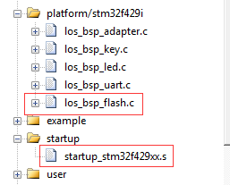

**注意**

LiteOS的默认startup汇编文件中只实现了使LiteOS内核正常运行的最小功能。

### 在los_bsp_flash.c文件中适配FatFs接口

为了时文件系统能正常工作，我们要适配FatFs文件系统的相关接口，可参考http://elm-chan.org/fsw/ff/00index_e.html网页上的相关说明进行适配.

- 适配disk_initialize接口，初始化设备
   
		DRESULT disk_ioctl (
		    BYTE pdrv,      /* Physical drive nmuber (0..) */
		    BYTE cmd,       /* Control code */
		    void *buff      /* Buffer to send/receive control data */
		 )
		{
		    DRESULT status = RES_PARERR;
		    switch (pdrv) {
		        case SPI_FLASH:
		            #if FATFS_FLASH_SPI ==1
		            status = TM_FATFS_FLASH_disk_ioctl(cmd, buff);
		            #endif
		            break;
		        default:
		            status = RES_PARERR;
		    }
		    return status;
		}

		DSTATUS TM_FATFS_FLASH_disk_initialize(void)
		{
		    return RES_OK; //由于是芯片内部flash，直接返回OK，如果是其他外设可进行相应初始化
		}

- 适配DSTATUS disk_status接口，获取设备状态

		DSTATUS disk_status (
		    BYTE pdrv /* Physical drive nmuber (0..) */
		)
		{
		    DSTATUS status = STA_NOINIT;
		    
		    switch (pdrv) {
		        case SPI_FLASH:
		            #if FATFS_FLASH_SPI ==1
		                status = TM_FATFS_FLASH_disk_status();
		            #endif
		            break;
		
		        default:
		            status = STA_NOINIT;
		    }
		    
		    return status;
		}
		
		DSTATUS TM_FATFS_FLASH_disk_status(void)
		{
		    return RES_OK; //芯片内部flash，直接返回OK，其他外设可以通过获取设备ID来验证
		}

- 适配disk_read接口，读取扇区数据

		DRESULT disk_read (
		    BYTE pdrv,      /* Physical drive nmuber (0..) */
		    BYTE *buff,     /* Data buffer to store read data */
		    DWORD sector,   /* Sector address (LBA) */
		    UINT count      /* Number of sectors to read (1..128) */
		)
		{
		    DRESULT status = RES_PARERR;
		    switch (pdrv) {
		        case SPI_FLASH:
		            #if FATFS_FLASH_SPI ==1
		                status = TM_FATFS_FLASH_disk_read(buff, sector, count);
		            #endif
		            break;
		        default:
		            status = RES_PARERR;
		    }
		    
		    return status;
		}
		
		/*******************************************************************************
		* Function Name  : TM_FATFS_FLASH_disk_read
		* Description    : Read sector(s)
		* Input          : DWORD sector
		                   UINT count
		* Output         : BYTE *buff
		* Return         : RES_OK/RES_ERROR
		*******************************************************************************/
		DRESULT TM_FATFS_FLASH_disk_read(BYTE *buff, DWORD sector, UINT count)
		{
		    u32 result;
		    
		    if (!count)return RES_PARERR;
		    
		    result = Flash_ReadPage(buff, sector, count);
		
		    if(result == STM_FLASH_SUCCESS)
		        return RES_OK;
		    else
		        return RES_ERROR;
		}
		
		/******************************************************************************
		* Function Name  : Flash_ReadPage
		* Description    : This routine is for sequential read from one or several
		* Input          : - PageNum￡oform which Page to read
		                   - NumPageToRead￡oread Page num 
		* Output         : - pBuffer: pointer on the Buffer to fill
		* Return         : New status of the NAND operation. This parameter can be:
		*******************************************************************************/
		
		u32 Flash_ReadPage(u8 *pBuffer, u32 PageNum, u32 NumPageToRead)
		{
		    u32 STMFlashStatus = STM_FLASH_SUCCESS;
		    u32 Address;
		    u32 index, data;
		    u8 tmpdata = 0x00;
		    
		    /* Unlock the Flash Program Erase controller */
		    HAL_FLASH_Unlock();
		    /* Clear All pending flags */
		    FLASH_ClearFlag(FLASH_FLAG_BSY | FLASH_FLAG_EOP | FLASH_FLAG_PGERR | FLASH_FLAG_WRPRTERR);
		    
		    while((NumPageToRead != 0x00) && (STMFlashStatus != STM_FLASH_INVALID_ADDRESS))
		    {
		        Address = FLASH_USER_START_ADDR + PageNum*STM_FLASH_SECTOR_SIZE;
		
		        for(index=0; index < STM_FLASH_SECTOR_SIZE; index++)
		        {
		            switch(index%4)
		            {
		                case 0:
		                    data = *(u32*)Address;
		                    Address += 4;
		
		                    tmpdata = DATA_1st(data);
		                    *pBuffer = tmpdata;
		                    pBuffer++;
		                    break;
		                case 1:
		                    tmpdata = DATA_2nd(data);
		                    *pBuffer = tmpdata;
		                    pBuffer++;
		                    break;
		                case 2:
		                    tmpdata = DATA_3rd(data);
		                    *pBuffer = tmpdata;
		                    pBuffer++;
		                    break;
		                case 3:
		                    tmpdata = DATA_4th(data);
		                    *pBuffer = tmpdata;
		                    pBuffer++;
		                    break;
		                default:
		                    break;
		            }
		        }
		        NumPageToRead--;
		        if(NumPageToRead != 0)
		        {
		            PageNum++;
		
		            /* Calculate Next page Address */
		            if(PageNum >= STM_FLASH_SECTOR_TOTAL)
		            STMFlashStatus = STM_FLASH_INVALID_ADDRESS;
		        }
		    }
		    HAL_FLASH_Lock();
		    return STMFlashStatus;
		}

- 适配disk_write接口，写扇区数据
		
		#if _USE_WRITE
		DRESULT disk_write (
		    BYTE pdrv,          /* Physical drive nmuber (0..) */
		    const BYTE *buff,   /* Data to be written */
		    DWORD sector,       /* Sector address (LBA) */
		    UINT count          /* Number of sectors to write (1..128) */
		)
		{
		    DRESULT status = RES_PARERR;
		    if (!count) {
		        return RES_PARERR;  /* Check parameter */
		    }
		
		    switch (pdrv) {
		        case SPI_FLASH:
		            #if FATFS_FLASH_SPI ==1
		                status = TM_FATFS_FLASH_disk_write((BYTE *)buff, sector, count);
		            #endif
		            break;
		        default:
		            status = RES_PARERR;
		    }
		
		    return status;
		}
		#endif
		
		/*******************************************************************************
		* Function Name  : TM_FATFS_FLASH_disk_write
		* Description    : Write sector(s)
		* Input          : DWORD sector
		                   UINT count
		                   BYTE *buff
		* Output         : None
		* Return         : RES_OK/RES_ERROR
		*******************************************************************************/
		DRESULT TM_FATFS_FLASH_disk_write(BYTE *buff, DWORD sector, UINT count)
		{
		    u32 WriteBlockNum,ulRet = STM_FLASH_SUCCESS;
		    u16 IndexTmp, OffsetPage;
		    
		    if(!count)return RES_PARERR;
		    
		    //data in witch Block
		    WriteBlockNum = sector/STM_FLASH_SECTOR_COUNT;
		    //data Offset Page of current Block
		    OffsetPage = sector%STM_FLASH_SECTOR_COUNT;
		    //Copy data to backup
		    ulRet = Flash_ReadPage((u8*)(&BackUpData[0][0]), WriteBlockNum*STM_FLASH_SECTOR_COUNT, STM_FLASH_SECTOR_COUNT);
		    if(STM_FLASH_SUCCESS != ulRet)
		    {
		        return RES_ERROR;
		    }
		    //Erase block data
		    ulRet = Flash_EraseBlock(WriteBlockNum);
		    if(STM_FLASH_SUCCESS != ulRet)
		    {
		        return RES_ERROR;
		    }
		    // write data
		    for (IndexTmp = 0; IndexTmp < STM_FLASH_SECTOR_COUNT; IndexTmp++ )
		    {
		        if((IndexTmp>=OffsetPage)&&(IndexTmp < (OffsetPage+count)))
		        {
		            ulRet = Flash_WritePage((u8 *)buff, WriteBlockNum*STM_FLASH_SECTOR_COUNT+IndexTmp, 1);
		            if(STM_FLASH_SUCCESS != ulRet)
		            {
		                return RES_ERROR;
		            }
		            buff = (u8 *)buff + STM_FLASH_SECTOR_SIZE;
		        }
		        else
		        {
		            //write backup data to flash
		            ulRet = Flash_WritePage((u8 *)(&BackUpData[IndexTmp][0]), WriteBlockNum*STM_FLASH_SECTOR_COUNT+IndexTmp, 1);
		            if(STM_FLASH_SUCCESS != ulRet)
		            {
		                return RES_ERROR;
		            }
		        }
		    }
		    return RES_OK;
		}
		
		/******************************************************************************
		* Function Name  : Flash_WritePage
		* Description    : This routine is for writing one or several 512 Bytes Page size.
		* Input          : pBuffer￡opointer on the Buffer to read
		                   PageNum
		                   NumPageToWrite
		* Output         : None
		* Return         : STM_FLASH_SUCCESS?￠STM_FLASH_ERROR
		*******************************************************************************/
		u32 Flash_WritePage(u8 *pBuffer, u32 PageNum, u32 NumPageToWrite)
		{
		    HAL_StatusTypeDef status = HAL_OK;
		    u32 STMFlashStatus = STM_FLASH_SUCCESS;
		    u32 Address;
		    u32 index, data, data32;
		
		    /* Unlock the Flash Program Erase controller */
		    HAL_FLASH_Unlock();
		    /* Clear All pending flags */
		    FLASH_ClearFlag(FLASH_FLAG_BSY | FLASH_FLAG_EOP | FLASH_FLAG_PGERR | FLASH_FLAG_WRPRTERR);
		
		    while( (NumPageToWrite != 0x00) && (STMFlashStatus != STM_FLASH_INVALID_ADDRESS) )
		    {
		        Address = FLASH_USER_START_ADDR + PageNum*STM_FLASH_SECTOR_SIZE;
		
		        for(index=0; index < STM_FLASH_SECTOR_SIZE; index++)
		        {
		            data32 = *pBuffer++;
		
		            switch(index%4)
		            {
		                case 0:
		                    data  = ( data32 << 0 ) & 0x000000FF;
		                    break;
		                case 1:
		                    data += ( data32 << 8 ) & 0x0000FF00;
		                    break;
		                case 2:
		                    data += ( data32 << 16) & 0x00FF0000;
		                    break;
		                case 3:
		                    data += ( data32 << 24) & 0xFF000000;
		                    status = HAL_FLASH_Program(FLASH_TYPEPROGRAM_WORD,Address, data);
		                    Address += 4;
		
		                    if(status != HAL_OK)
		                    {
		                        HAL_FLASH_Lock();
		                        return STM_FLASH_ERROR;
		                    }
		
		                    break;
		                default:
		                    break;
		            }
		        }  
		        NumPageToWrite--;
		        if(NumPageToWrite != 0)
		        {
		            PageNum++;
		
		            /* Calculate Next page Address */
		            if(PageNum >= STM_FLASH_SECTOR_TOTAL)
		            STMFlashStatus = STM_FLASH_INVALID_ADDRESS;
		        }
		    }
		
		    HAL_FLASH_Lock();
		
		    return STMFlashStatus;
		}
		      
		/******************************************************************************
		* Function Name  : Flash_EraseBlock
		* Description    : Erase Block before write
		* Input          : - BlockNum￡oform which Page to read
		* Output         : None
		* Return         : STM_FLASH_ERROR/STM_FLASH_SUCCESS
		*******************************************************************************/
		u32 Flash_EraseBlock(u32 BlockNum)
		{
		    /* Unlock the Flash to enable the flash control register access *************/ 
		    HAL_FLASH_Unlock();
		    
		    /* Erase the user Flash area
		    (area defined by FLASH_USER_START_ADDR 
		    and FLASH_USER_END_ADDR) ***********/
		    
		    /* Get the 1st sector to erase */
		    FirstSector = GetSector(FLASH_USER_START_ADDR);
		    
		    /* Get the number of sector to erase from 1st sector*/
		    NbOfSectors = 1;
		    
		    /* Fill EraseInit structure*/
		    EraseInitStruct.TypeErase = FLASH_TYPEERASE_SECTORS;
		    EraseInitStruct.VoltageRange = FLASH_VOLTAGE_RANGE_3;
		    EraseInitStruct.Sector = FirstSector + BlockNum;
		    EraseInitStruct.NbSectors = NbOfSectors;
		    if(HAL_FLASHEx_Erase(&EraseInitStruct, &SectorError) != HAL_OK)
		    { 
		        /*
		            Error occurred while sector erase. 
		            User can add here some code to deal with this error. 
		            SectorError will contain the faulty sector and then to know the code error on this sector,
		            user can call function 'HAL_FLASH_GetError()'
		        */
		        /*
		            FLASH_ErrorTypeDef errorcode = HAL_FLASH_GetError();
		        */
		        Error_Handler();
		        return STM_FLASH_ERROR;
		    }
		    
		    /*
		        Note: If an erase operation in Flash memory also concerns data in the data or instruction cache,
		        you have to make sure that these data are rewritten before they are accessed during code
		        execution. If this cannot be done safely, it is recommended to flush the caches by setting the
		        DCRST and ICRST bits in the FLASH_CR register. 
		    */
		        
		    __HAL_FLASH_DATA_CACHE_DISABLE();
		    __HAL_FLASH_INSTRUCTION_CACHE_DISABLE();
		    
		    __HAL_FLASH_DATA_CACHE_RESET();
		    __HAL_FLASH_INSTRUCTION_CACHE_RESET();
		    
		    __HAL_FLASH_INSTRUCTION_CACHE_ENABLE();
		    __HAL_FLASH_DATA_CACHE_ENABLE();
		    
		    return STM_FLASH_SUCCESS;
		}

- 适配disk_ioctl接口，控制设备依赖函数
     			
		#if _USE_IOCTL
		DRESULT disk_ioctl (
		    BYTE pdrv,      /* Physical drive nmuber (0..) */
		    BYTE cmd,       /* Control code */
		    void *buff      /* Buffer to send/receive control data */
		)
		{
		    DRESULT status = RES_PARERR;
		    switch (pdrv) {
		        case SPI_FLASH:
		            #if FATFS_FLASH_SPI ==1
		                status = TM_FATFS_FLASH_disk_ioctl(cmd, buff);
		            #endif
		            break;
		        default:
		            status = RES_PARERR;
		    }
		    return status;
		}
		#endif
		     
		/*******************************************************************************
		* Function Name  : TM_FATFS_FLASH_disk_ioctl
		* Description    : detail disk iocotl cmd
		* Input          : cmd
		* Output         : buff
		* Return         : RES_OK/RES_ERROR
		*******************************************************************************/
		DRESULT TM_FATFS_FLASH_disk_ioctl(BYTE cmd, char *buff)
		{
		    switch (cmd) 
		    {
		        case GET_SECTOR_SIZE :                      // Get R/W sector size (WORD)
		            *(WORD * )buff = STM_FLASH_SECTOR_SIZE; // flash read/write unit
		            break;
		        case GET_SECTOR_COUNT:
		            *(DWORD * )buff = STM_FLASH_SECTOR_TOTAL; //Get sector num
		            break;
		        case GET_BLOCK_SIZE :  // Get erase block size in unit of sector (DWORD)
		            *(DWORD * )buff = STM_FLASH_SECTOR_COUNT;
		            break;
		        case CTRL_SYNC :
		            break;
		        default:
		            return RES_ERROR;
		    }
		
		    return RES_OK;
		}

- 适配get_fattime接口，获取当前时间

		__weak DWORD get_fattime(void) {
		/* Returns current time packed into a DWORD variable */
		return    ((DWORD)(2017 - 1980) << 25)  /* Year 2013 */
		    | ((DWORD)2 << 21)              /* Month 7 */
		    | ((DWORD)28 << 16)             /* Mday 28 */
		    | ((DWORD)12 << 11)             /* Hour 12 */
		    | ((DWORD)59 << 5)              /* Min 59 */
		    | ((DWORD)59 >> 1);             /* Sec 59 */
		}

**注意**

示例中的时间为固定值，用户可设置为RTC时钟的时间

### 在los_bsp_flash.h文件中进行相关配置
 
	#define FLASH_USER_START_ADDR   ADDR_FLASH_SECTOR_5   /* Start @ of user Flash area */
	#define FLASH_USER_END_ADDR     (ADDR_FLASH_SECTOR_11  +  GetSectorSize(ADDR_FLASH_SECTOR_11) -1) /* End @ of user Flash area : sector start address + sector size -1 */
	
	/* Flash memory address of physics */
	#define STM32_FLASH_ADDR        ((u32)0x08000000)
	#define STM32_BLOCK_SIZE        ((u32)0x20000)//扇区大小设置为128K
	
	/* Flash  memory parameters */
	#define STM_FLASH_SECTOR_SIZE       ((u16)0x1000) /* 4096 bytes per page w/o Spare Area */
	#define STM_FLASH_SECTOR_COUNT      ((u16)0x0020) /* 128k = 32*4096 bytes sectors per block */
	#define STM_FLASH_SECTOR_TOTAL      ((u16)((FLASH_USER_END_ADDR - FLASH_USER_START_ADDR +1)/STM_FLASH_SECTOR_SIZE)) /* (128/4)*7= 224*/

### 修改ffconf.h文件，进行文件系统配置

    #define _VOLUMES    2  /* Number of volumes (logical drives) to be used. */
    
    #define _CODE_PAGE  936  //支持简体中文
    
    #define _MIN_SS     512
    #define _MAX_SS     4096 //设置setcor大小
    
    #define _USE_LFN    2    //使用长文件名
    #define _MAX_LFN    255

**注意**

   关于配置的详细说明，请参考ffconf.h文件中的注释。

### 添加LiteOS封装的文件操作常用接口

在完成文件Fat文件系统适配后，为了便于使用，可添加LiteOS封装的接口文件los_fs.c到工程的kernel目录(该存放在kernel/base/fs文件夹下)。

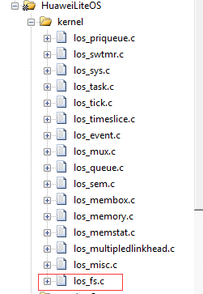

los_fs.c文件实现如下：
	
	#include "los_fs.h"
	#include "los_fs_adapter.h"
	
	
	/*******************************************************************************
	* Function Name  : LOS_fopen
	* Description    : Open or create a file
	* Input          : const char * path,
	                   unsigned char mode
	* Output         : None
	* Return         : int fd
	*******************************************************************************/
	int LOS_fopen (const char * path, unsigned char mode)
	{
	    return los_fopen(path, mode);
	}
	
	/*******************************************************************************
	* Function Name  : LOS_fclose
	* Description    : Close an open file object
	* Input          : int fd
	* Output         : None
	* Return         : LOS_FRESULT
	*******************************************************************************/
	LOS_FRESULT LOS_fclose (int fd)
	{
	    return los_fclose (fd);
	}
	
	/*******************************************************************************
	* Function Name  : LOS_fread
	* Description    : Read data from a file
	* Input          : size_t size,
	                   size_t count,
	                   int fd
	* Output         : void* buffer
	* Return         : num of read byte
	*******************************************************************************/
	size_t LOS_fread (void* buffer, size_t size, size_t count,int fd)
	{
	    return los_fread(buffer, size, count,fd);
	}
	
	/*******************************************************************************
	* Function Name  : LOS_fwrite
	* Description    : Write data to a file
	* Input          : const void* buffer,
	                   size_t size,
	                   size_t count,
	                   int fd
	* Output         : None
	* Return         : size_t: num of write byte
	*******************************************************************************/
	size_t LOS_fwrite(const void* buffer, size_t size, size_t count, int fd)
	{
	    return los_fwrite(buffer, size, count, fd);
	}
	
	/*******************************************************************************
	* Function Name  : LOS_fseek
	* Description    : Move file pointer of a file object
	* Input          : long offset,
	                   int fd
	* Output         : None
	* Return         : LOS_FRESULT
	*******************************************************************************/
	LOS_FRESULT LOS_fseek(int fd, long offset)
	{
	    return los_fseek (fd, offset);
	}
	
	/*******************************************************************************
	* Function Name  : LOS_fsync
	* Description    : Flush cached data of a writing file
	* Input          : int fd
	* Output         : None
	* Return         : LOS_FRESULT
	*******************************************************************************/
	LOS_FRESULT LOS_fsync (int fd)
	{
	    return los_fsync (fd);
	}
	
	/*******************************************************************************
	* Function Name  : LOS_fmount
	* Description    : Mount/Unmount a logical drive
	* Input          : const char* path,
	                   unsigned char opt
	* Output         : None
	* Return         : LOS_FRESULT
	*******************************************************************************/
	LOS_FRESULT LOS_fmount (const char* path, unsigned char opt)
	{
	    return los_fmount(path, opt);
	}
	
	/*******************************************************************************
	* Function Name  : LOS_fmkfs
	* Description    : Create a file system on the volume
	* Input          : const char* path,
	                   unsigned char sfd,
	                   unsigned int au
	* Output         : None
	* Return         : LOS_FRESULT
	*******************************************************************************/
	LOS_FRESULT LOS_fmkfs (const char* path, unsigned char sfd, unsigned int au)
	{
	    return los_fmkfs(path, sfd, au);
	}

### 修改los_bsp_adapter.c文件

- 代码添加完毕之后，需要修改los_bsp_adapter.c中的system tick时钟const unsigned int sys_clk_freq = 16000000;修改为const unsigned int sys_clk_freq = 180000000; 代码给出的时默认system clock值。

		const unsigned int sys_clk_freq = 180000000;

- 增加system tick中断的处理内容适配stm32工程的运行。

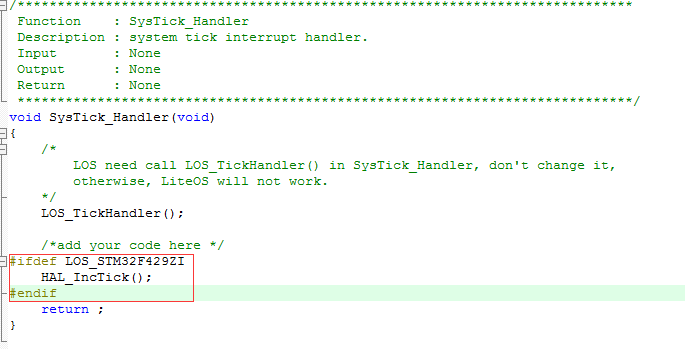

### 修改main.c文件

- 在main.c中添加平台初始化以及系统时钟配置的调用

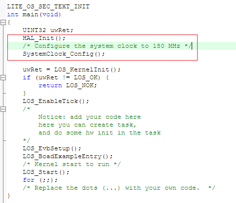

- 添加los_api_fs.c文件到工程example目录下

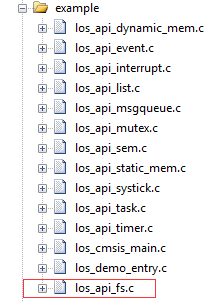

- 在mian.c中调用api测试接口函数Example_FsEntry(包含los_api_fs.h头文件)

		LITE_OS_SEC_TEXT_INIT
		int main(void)
		{
		    UINT32 uwRet;
		    
		    /*
		        add you hardware init code here
		        for example flash, i2c , system clock ....
		    */
		    HAL_Init();
		    SystemClock_Config();
		
		    /* Init LiteOS kernel */
		    uwRet = LOS_KernelInit();
		    if (uwRet != LOS_OK) {
		        return LOS_NOK;
		    }
		    
		    /* Enable LiteOS system tick interrupt */
		    LOS_EnableTick();
		    
		    /*
		        Notice: add your code here
		        here you can create task for your function 
		        do some hw init that need after systemtick init
		    */
		    LOS_EvbSetup();
		    
		    //LOS_Demo_Entry();
		    
		    //LOS_BoadExampleEntry();
		    
		    Example_FsEntry();
		    
		    /* Kernel start to run */
		    LOS_Start();
		    for (;;);
		    /* Replace the dots (...) with your own code. */
		}
 
- 测试示例代码如下：
		    	
		void Example_FsTsk(void)
		{
		    int fnew;
		    unsigned int br, bw; /* File R/W count */
		    
		    /************************* MCU flash FS *********************************************/
		    //mount the file system
		    res_flash = LOS_fmount("1:",1);
		    LOS_EvbUartPrintf("\r\n f_mount res_flash = [%d] \r\n",res_flash);
		    
		    //If there is no file system,format to create the file system.
		    if(res_flash == LOS_FS_NO_FILESYSTEM)
		    {
		        res_flash = LOS_fmkfs("1:",0,0);                    //format
		        LOS_EvbUartPrintf("\r\n f_mkfs res_flash=%d",res_flash);
		        res_flash = LOS_fmount("1:",0);                     //After formatting,cancel the mount first.
		        res_flash = LOS_fmount("1:",1);                     //mount
		        LOS_EvbUartPrintf("\r\n remount res_flash = [%d] \r\n",res_flash);
		    }
		    
		    //File system test: written test. Open the file, if there is no file, create it.
		    fnew = LOS_fopen("1:LiteOS.txt", LOS_FS_CREATE_ALWAYS | LOS_FS_WRITE );
		    if(0 != fnew)
		    {
		        LOS_EvbUartPrintf("\r\nWrite = [%s] ", textFileBuffer);
		        bw = LOS_fwrite(textFileBuffer,1, sizeof(textFileBuffer),fnew);
		        if(0 == bw)
		        {
		            LOS_EvbUartPrintf("\r\f_write failed.");
		            LOS_EvbLedControl(LOS_LED2, LED_ON);
		            
		            LOS_fclose(fnew);
		            return;
		        }   
		        LOS_EvbUartPrintf("\r\nbw = [%d] ", bw);
		        LOS_fclose(fnew);
		    }
		    else
		    {
		        LOS_EvbUartPrintf("\r\ncreate file failed.");
		        LOS_EvbLedControl(LOS_LED2, LED_ON);
		        return;
		    }
		
		    //File system test: read test.
		    fnew = LOS_fopen("1:LiteOS.txt", LOS_FS_OPEN_EXISTING | LOS_FS_READ);
		    if(0 == fnew)
		    {
		        LOS_EvbUartPrintf("\r\f_open failed.");
		        LOS_EvbLedControl(LOS_LED2, LED_ON);
		        return;
		    }
		    
		    br = LOS_fread( buffer, 1 ,sizeof(buffer),fnew);
		    
		    if(0 != strncmp((char *)textFileBuffer,(char *)buffer,sizeof(textFileBuffer)))
		    {
		        LOS_EvbUartPrintf("\r\f_read failed.");
		        LOS_EvbLedControl(LOS_LED2, LED_ON);
		    }
		    else
		    {
		        LOS_EvbLedControl(LOS_LED1, LED_ON);
		        LOS_EvbUartPrintf("\r\nRead sucess buffer = [%s],br = [%d]", buffer,br);
		    }
		    
		    /* Close open files */
		    res_flash = LOS_fclose(fnew);
		    
		    //不再使用文件系统，取消挂载文件系统
		    res_flash = LOS_fmount("1:",0);
		    
		    while(1)
		    {
		        LOS_EvbLedControl(LOS_LED3, LED_ON);
		        Delay(0xffffff);
		        LOS_EvbLedControl(LOS_LED3, LED_OFF);
		        Delay(0xffffff);
		    }
		}

### 修改stm32f4xx_it.c文件

- 将stm32f4xx_it.c中的SysTick_Handler、PendSV_Handler的实现删除或者if 0掉。

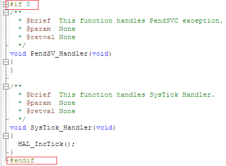

### 修改stm32f4xx_hal_msp.c文件
- 将stm32f4xx_hal_msp.c中的main.h替换成los_bsp_uart.h。

		//#include "main.h"
		#include "los_bsp_uart.h"

### 添加头文件路径包含以及宏定义

- 参考STM32的原始工程，将其中的头文件搜索路径以及宏定义拷贝到LiteOS工程的设置中，并且定义宏LOS_STM32F429ZI、LOS_FLASH

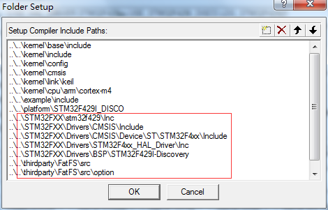

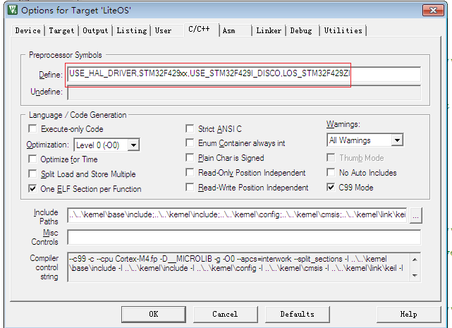

### 编译运行

- 以上步骤完成之后，编译代码，连接串口进行调试，可以相关打印信息，如果成功,LD3绿灯点亮，否则LD4红灯点亮。

## 7 其他说明

设置扇区大小时，首先要阅读芯片手册中有关falsh的说明

### 内部Flash以Sector为单位时，关于扇区大小设置设置说明

  当芯片内部flash以Sector为单位，例如STM32F429ZI芯片，内部falsh分为两个bank，每个bank分不同大小的扇区，最大的扇区为128k，最小的为16k，没有细分为page，那么数据擦除的最小单位为Sector，而FatFS中只有block和sector的概念，为了匹配，我们可以把一个sector当成一个block，把它再看做由4k大小的virtualsector组成，但是要记住，进行数据写操作时需要同时擦除的sector个数为 = (Sector size)/(virtual sector size),有了这个概念就可以与FatFS进行匹配了，示例代码中使用的是SECTOR_5到SECTOR_11。

		 /* Base address of the Flash sectors Bank 1 */
		#define ADDR_FLASH_SECTOR_0     ((uint32_t)0x08000000) /* Base @ of Sector 0, 16 Kbytes   */
		#define ADDR_FLASH_SECTOR_1     ((uint32_t)0x08004000) /* Base @ of Sector 1, 16 Kbytes   */
		#define ADDR_FLASH_SECTOR_2     ((uint32_t)0x08008000) /* Base @ of Sector 2, 16 Kbytes   */
		#define ADDR_FLASH_SECTOR_3     ((uint32_t)0x0800C000) /* Base @ of Sector 3, 16 Kbytes   */
		#define ADDR_FLASH_SECTOR_4     ((uint32_t)0x08010000) /* Base @ of Sector 4, 64 Kbytes   */
		#define ADDR_FLASH_SECTOR_5     ((uint32_t)0x08020000) /* Base @ of Sector 5, 128 Kbytes  */
		#define ADDR_FLASH_SECTOR_6     ((uint32_t)0x08040000) /* Base @ of Sector 6, 128 Kbytes  */
		#define ADDR_FLASH_SECTOR_7     ((uint32_t)0x08060000) /* Base @ of Sector 7, 128 Kbytes  */
		#define ADDR_FLASH_SECTOR_8     ((uint32_t)0x08080000) /* Base @ of Sector 8, 128 Kbytes  */
		#define ADDR_FLASH_SECTOR_9     ((uint32_t)0x080A0000) /* Base @ of Sector 9, 128 Kbytes  */
		#define ADDR_FLASH_SECTOR_10    ((uint32_t)0x080C0000) /* Base @ of Sector 10, 128 Kbytes */
		#define ADDR_FLASH_SECTOR_11    ((uint32_t)0x080E0000) /* Base @ of Sector 11, 128 Kbytes */
		
		/* Base address of the Flash sectors Bank 2 */
		#define ADDR_FLASH_SECTOR_12     ((uint32_t)0x08100000) /* Base @ of Sector 0, 16 Kbytes   */
		#define ADDR_FLASH_SECTOR_13     ((uint32_t)0x08104000) /* Base @ of Sector 1, 16 Kbytes   */
		#define ADDR_FLASH_SECTOR_14     ((uint32_t)0x08108000) /* Base @ of Sector 2, 16 Kbytes   */
		#define ADDR_FLASH_SECTOR_15     ((uint32_t)0x0810C000) /* Base @ of Sector 3, 16 Kbytes   */
		#define ADDR_FLASH_SECTOR_16     ((uint32_t)0x08110000) /* Base @ of Sector 4, 64 Kbytes   */
		#define ADDR_FLASH_SECTOR_17     ((uint32_t)0x08120000) /* Base @ of Sector 5, 128 Kbytes  */
		#define ADDR_FLASH_SECTOR_18     ((uint32_t)0x08140000) /* Base @ of Sector 6, 128 Kbytes  */
		#define ADDR_FLASH_SECTOR_19     ((uint32_t)0x08160000) /* Base @ of Sector 7, 128 Kbytes  */
		#define ADDR_FLASH_SECTOR_20     ((uint32_t)0x08180000) /* Base @ of Sector 8, 128 Kbytes  */
		#define ADDR_FLASH_SECTOR_21     ((uint32_t)0x081A0000) /* Base @ of Sector 9, 128 Kbytes  */
		#define ADDR_FLASH_SECTOR_22     ((uint32_t)0x081C0000) /* Base @ of Sector 10, 128 Kbytes */
		#define ADDR_FLASH_SECTOR_23     ((uint32_t)0x081E0000) /* Base @ of Sector 11, 128 Kbytes */

### 内部Flash以page为单位时，关于扇区大小设置设置说明

  当芯片内部flash以page为单位，例如STM32F103ZE芯片，每个page的大小为2K，共256个，那么我们可以将每个page看做一个block，每个block看做4个sector，那么每次擦除的最小单位为4个sector，即进行一次page擦除操作；当然我们也可以设置sector大小为4k，这样每次擦除的最小单位为1个sector，即进行两次page擦除操作。

### 使用 MCU 内部 flash 时要注意的问题
   
  使用MCU内部flash时，要注意不能擦除存放code的扇区，尽量使用地址靠后的扇区。

### 使用外部存储设备存储
  
  使用芯片外部存储设备进行文件存储时，需要适配的接口与使用芯片内部flash完全相同，移植流程也完全相同。

**注意**

不管使用哪种flash，都需要注意“存储设备擦除操作的单位大小”与“文件系统设置的sector大小”之间的关系：

- 当擦除操作单位大小为sector大小的整数倍时，需要在擦除数据前先将这些数据进行缓存，以便修改其中一个sector的数据后将其他sector的数据再写回flash中。

- 当设置的Sector大小为擦除操作单位大小的整数倍时，可以根据单次可擦除的大小，将数据分次写入到每个单元，写每个单元之前先进行擦除操作。

### API接口使用说明
   
- 关于FatFs详细的API接口使用说明，可以参考官方的相关资料：http://elm-chan.org/fsw/ff/00index_e.html

- 关于LiteOS封装的文件系统操作接口，更详细的使用说明请参考源码doc目录下《LiteOS_Fs_Instruction.md》文件

 

	

