## 1关于本文档的开源协议说明
**您可以自由地：**

**分享** 

- 在任何媒介以任何形式复制、发行本文档

**演绎** 

- 修改、转换或以本文档为基础进行创作。只要你遵守许可协议条款，许可人就无法收回你的这些权利。

**惟须遵守下列条件：**

**署名** 

- 您必须提供适当的证书，提供一个链接到许可证，并指示是否作出更改。您可以以任何合理的方式这样做，但不是以任何方式表明，许可方赞同您或您的使用。

**非商业性使用** 

- 您不得将本作品用于商业目的。

**相同方式共享** 

- 如果您的修改、转换，或以本文档为基础进行创作，仅得依本素材的
授权条款来散布您的贡献作品。

**没有附加限制** 

- 您不能增设法律条款或科技措施，来限制别人依授权条款本已许可的作为。

**声明：**

-  当您使用本素材中属于公众领域的元素，或当法律有例外或限制条款允许您的使用，
则您不需要遵守本授权条款。
未提供保证。本授权条款未必能完全提供您预期用途所需要的所有许可。例如：形象
权、隐私权、著作人格权等其他权利，可能限制您如何使用本素材。

**注意**

- 为了方便用户理解，这是协议的概述. 可以访问网址 https://creativecommons.org/licenses/by-sa/3.0/legalcode 了解完整协议内容.

## 2前言
### 目的

本文档介如何移植Huawei LiteOS到第三方开发板，并成功运行基础示例。

### 读者对象

本文档主要适用于使用Huawei LiteOS Kernel进行开发的开发者。

本文档主要适用于以下对象：

- 物联网端软件开发工程师

- 物联网架构设计师

### 符号约定
在本文中可能出现下列标志，它们所代表的含义如下。

     用于警示紧急的危险情形，若不避免，将会导致人员死亡或严重的人身伤害

    用于警示潜在的危险情形，若不避免，可能会导致人员死亡或严重的人身伤害

    用于警示潜在的危险情形，若不避免，可能会导致中度或轻微的人身伤害

     用于传递设备或环境安全警示信息，若不避免，可能会导致设备损坏、数据丢失、设备性能降低或其它不可预知的结果“注意”不涉及人身伤害

| 说明	|		“说明”不是安全警示信息，不涉及人身、设备及环境伤害信息	|

### 修订记录
修改记录累积了每次文档更新的说明。最新版本的文档包含以前所有文档版本的更新
内容。

<table>
	<tr>
	<td>日期</td>
	<td>修订版本</td>
	<td>描述</td>
	</tr>
	<tr>
	<td>2017年01月17日</td>
	<td>1.0</td>
	<td>完成初稿</td>
	</tr>
    </tr>
    <td>2017年03月10日</td>
	<td>1.1</td>
	<td>更新为通用移植指南，并增加移植相关注意事项及说明</td>
	</tr>
</table>

## 3概述

目前在github上已开源的Huawei LiteOS_Kernel源码已适配好STM32F412、STM32F429、STM32L476、GD32F450、GD32F190等芯片的keil示例工程，如果您使用的芯片(开发板)未在其中，可以参照本文档从零开始创建自己的发开工程，并验证移植的结果。

## 4环境准备
基于Huawei LiteOS Kernel开发前，我们首先需要准备好单板运行的环境，包括软件环
境和硬件环境。
硬件环境：

<table>
	<tr>
	<td>所需硬件</td>
	<td>描述</td>
	</tr>
	<tr>
	<td>开发板</td>
	<td>基于Cortex-M3或Cortex-M4内核的芯片开发板</td>
	</tr>
	<tr>
	<td>PC机</td>
	<td>用于编译、加载并调试镜像</td>
	</tr>
	<tr>
	<td>电源</td>
	<td>开发板供电</td>
	</tr>
</table>

软件环境：

<table>
	<tr>
	<td>软件</td>
	<td>描述</td>
	</tr>
	<tr>
	<td>Window 7 操作系统</td>
	<td>安装Keil和相关调试驱动的操作系统</td>
	</tr>
	<tr>
	<td>Keil(5.18以上版本)</td>
	<td>用于编译、链接、调试程序代码
	uVision V5.18.0.0 MDK-Lite</td>
	</tr>
	<tr>
	<td>Link驱动</td>
	<td>开发板与pc连接的驱动程序，用户加载及调试程序代码</td>
	</tr>
</table>

**说明**

Keil工具需要开发者自行购买，Link驱动程序需根据具体使用的开发板芯片来确定，开发板配套的资料中会提供，或者在使用的芯片官网下载。

## 5获取Huawei LiteOS 源码

首先下载Huawei LiteOS开发包，步骤如下：

- 仓库地址：https://github.com/LITEOS/LiteOS_Kernel.git 

- 点击”clone or download”按钮,下载源代码

- 目录结构如下：

关于代码树中各个目录存放的源代码的相关内容简介如下：

<table>
<tr>
	<td>一级目录</td>
	<td>二级目录</td>
	<td>说明</td>
</tr>
<tr>
	<td>doc</td>
	<td></td>
	<td>此目录存放的是LiteOS的使用文档和API说明文档</td>
</tr>
<tr>
	<td>example</td>
	<td>api</td>
	<td>此目录存放的是内核功能测试用的相关用例的代码</td>
</tr>
<tr>
	<td></td>
	<td>include</td>
	<td>aip功能头文件存放目录</td>
</tr>
<tr>
	<td>kernel</td>
	<td>base</td>
	<td>此目录存放的是与平台无关的内核代码，包含核心提供给外部调用的接口的头文件以及内核中进程调度、进程通信、内存管理等等功能的核心代码。用户一般不需要修改此目录下的相关内容。</td>
</tr>
<tr>
	<td></td>
	<td>cmsis</td>
	<td>LiteOS提供的cmsis接口</td>
</tr>
<tr>
	<td></td>
	<td>config</td>
	<td>此目录下是内核资源配置相关的代码，在头文件中配置了LiteOS所提供的各种资源所占用的内存池的总大小以及各种资源的数量，例如task的最大个数、信号量的最大个数等等</td>
</tr>
<tr>
	<td></td>
	<td>cpu</td>
	<td>此目录以及以下目录存放的是与体系架构紧密相关的适配LiteOS的代码。比如目前我们适配了arm/cortex-m4及arm/cortex-m3系列对应的初始化内容。</td>
</tr>
<tr>
	<td></td>
	<td>include</td>
	<td>内核的相关头文件存放目录</td>
</tr>
<tr>
	<td></td>
	<td>link</td>
	<td>与IDE相关的编译链接相关宏定义</td>
</tr>
<tr>
	<td>platform</td>
	<td>GD32F190R-EVAL</td>
	<td>GD190开发板systick以及led、uart、key驱动bsp适配代码</td>
</tr>
<tr>
	<td></td>
	<td>GD32F450i-EVAL</td>
	<td>GD450开发板systick以及led、uart、key驱动bsp适配代码</td>
</tr>
<tr>
	<td></td>
	<td>STM32F412ZG-NUCLEO</td>
	<td>STM32F412开发板systick以及led、uart、key驱动bsp适配代码</td>
</tr>
<tr>
	<td></td>
	<td>STM32F429I_DISCO</td>
	<td>STM32F429开发板systick以及led、uart、key驱动bsp适配代码</td>
</tr>
<tr>
	<td></td>
	<td>STM32L476RG_NUCLEO</td>
	<td>STM32L476开发板systick以及led、uart、key驱动bsp适配代码</td>
</tr>
<tr>
	<td></td>
	<td>LPC824_LITE</td>
	<td>LPC824Lite开发板systick及驱动相关代码</td>
</tr>
<tr>
	<td></td>
	<td>LPC54110_BOARD</td>
	<td>LPC54110开发板systick及驱动相关代码</td>
</tr>
<tr>
	<td></td>
	<td>MM32F103_MINI</td>
	<td>MM32F103开发板systick及驱动相关代码</td>
</tr>
<tr>
	<td></td>
	<td>STM32F746ZG_NUCLEO</td>
	<td>STM32F746ZG开发板systick以及led、uart、key驱动bsp适配代码</td>
</tr>
<tr>
	<td></td>
	<td>LOS_EXPAND_XXX</td>
	<td>用于新扩展的开发板systick以及led、uart、key驱动bsp适配代码</td>
</tr>
<tr>
	<td>projects</td>
	<td>STM32F412ZG-NUCLEO-KEIL</td>
	<td>stm32f412开发板的keil工程目录</td>
</tr>
<tr>
	<td></td>
	<td>STM32F429I_DISCO_IAR</td>
	<td>stm32f429开发板的iar工程目录</td>
</tr>
<tr>
	<td></td>
	<td>STM32F429I_DISCO_KEIL</td>
	<td>stm32f429开发板的keil工程目录</td>
</tr>
<tr>
	<td></td>
	<td>STM32L476R-NUCLEO-KEIL</td>
	<td>stm32l476开发板的keil工程目录</td>
</tr>
<tr>
	<td></td>
	<td>GD32F190R-EVAL-KEIL</td>
	<td>gd32f190开发板的keil工程目录</td>
</tr>
<tr>
	<td></td>
	<td>GD32F450i-EVAL-KEIL</td>
	<td>gd32f450开发板的keil工程目录</td>
</tr>
<tr>
	<td></td>
	<td>LPC824_LITE_KEIL</td>
	<td>lpc824Lite开发板的keil工程目录</td>
</tr>
<tr>
	<td></td>
	<td>LPC54110_BOARD_KEIL</td>
	<td>lpc54110开发板的keil工程目录</td>
</tr>
<tr>
	<td></td>
	<td>MM32F103_MINI_KEIL</td>
	<td>MindMotion MM32 MiniBoard开发板的keil工程目录</td>
</tr>
<tr>
	<td></td>
	<td>STM32F746ZG-NUCLEO-KEIL</td>
	<td>NUCLEO-F746ZG 开发板的keil工程目录</td>
</tr>
<tr>
	<td>user</td>
	<td></td>
	<td>此目录存放用户测试代码，LiteOS的初始化和使用示例在main.c文件中</td>
</tr>
</table>

获取Huawei LiteOS源代码之后，我们就可以开始创建自己的project开发工程了，详细内容请参考后续各章节。

## 6创建Huawei LiteOS 工程

### 6.1 创建工程

获取到LiteOS内核代码后，如果您本地有开发板相关的驱动代码，可以先将您本地的驱动代码库拷贝到platform\LOS_EXPAND_XXX目录下，以便添加到工程中。

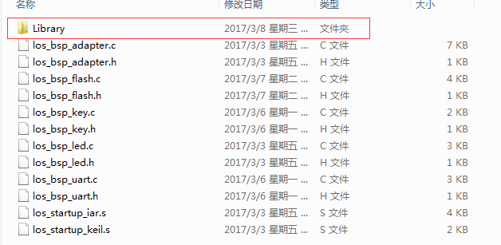

在安装好Keil等开发工具后，我们使用Keil集成开发环境创建Huawei LiteOS工程，步骤如下：

- 打开Keil uVision5， 然后点击project->New uVision Project...创建一个新的工程

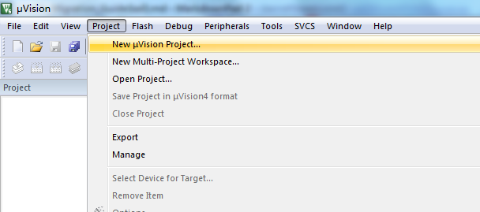

- 新建保存工程的文件夹LiteOS_xxx_Expand,保存工程名，比如HuaweiLiteOS

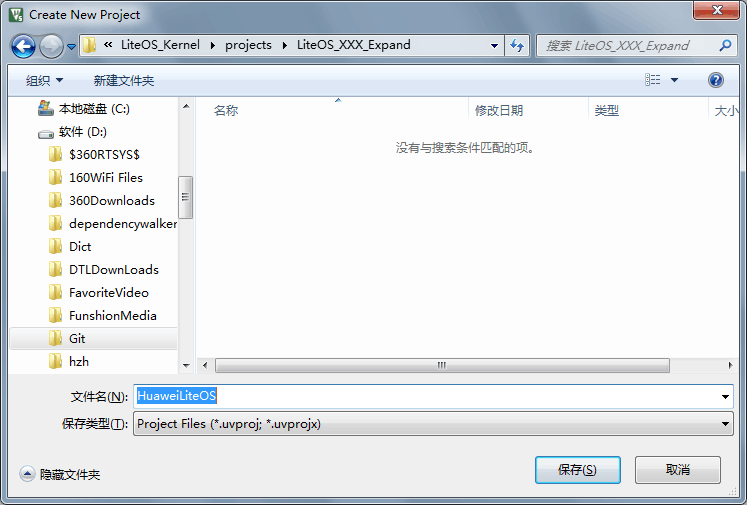

- 保存后会立即弹出芯片型号选择的窗口，根据实际的开发板的芯片进行选择，比如您使用的是stm32f429zi芯片。

- 然后选择要包含的开发基础库，比如CMSIS、DEVICE两个选项可以选择平台提供的支持包和启动汇编文件，目前LiteOS有提供的启动文件是配合中断动态注册功能使用的，如果您不需要进行中断动态注册，可以勾选startup，也可以在工程建好后手动添加启动文件，此处选择"OK"直接跳过。

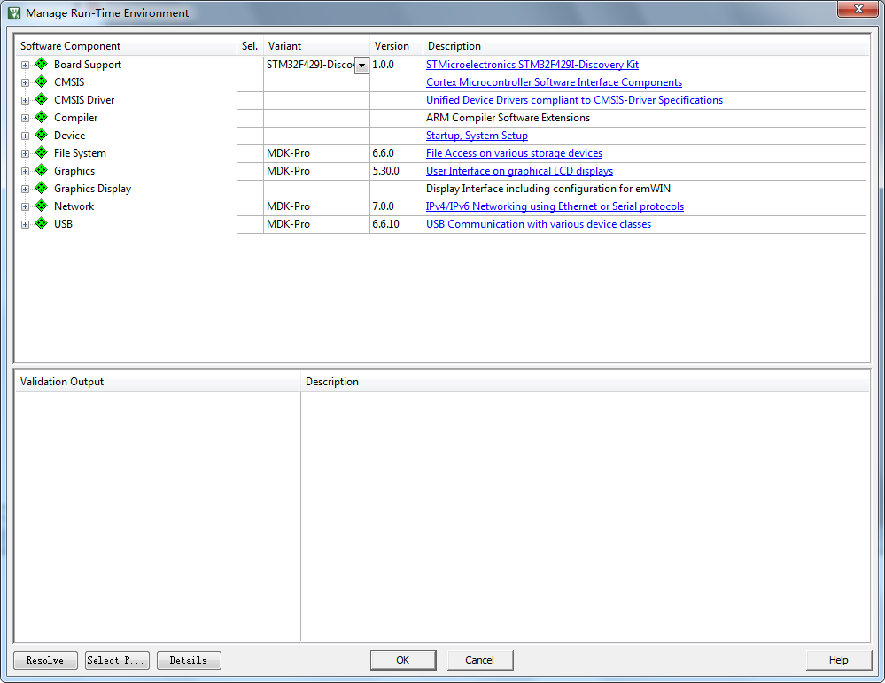

至此，我们的工程已经创建完成，如下图所示：

完成上面的芯片和支持包选择之后，可以将内核源代码添加到工程中。

### 6.2 添加kernel代码到工程

- 创建LiteOS的相关目录层级

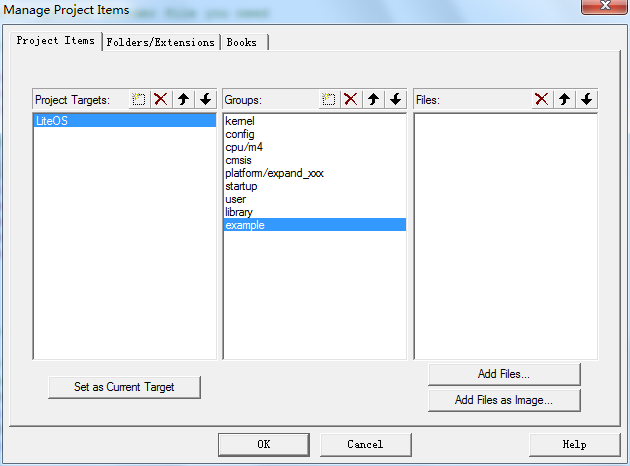

创建完成目录树之后我们添加源代码到目录树中，最终添加完成的内容如下：

- 将kernel/base目录下的所有C文件添加到工程中的kernel下
- 将kernel/cmsis目录下的所有C文件添加到工程中的cmsis下。
- 将platform\LOS_EXPAND_XXX目录下的所有C文件添加到工程中的platform/expand_xxx下(expand_xxx文件夹名字可自行修改)
- 根据芯片内核型号，将kernel\cpu\arm\cortex-m4（或者cortex-m3）目录下的所有C文件以及汇编代码添加到工程中的cpu/m4（cpu/m3）下
- 将kernel\config目录下的所有C文件添加到工程中的config下
- 将user目录下的所有C文件添加到工程中的user下
- 如果需要使用中断动态注册功能或者本地没有可用的启动文件，可以将platform\LOS_EXPAND_XXX目录下的los_startup_keil.s汇编文件添加到工程中的startup目录下，或者添加芯片官方提供的启动文件，比如您使用的是stm32f429zi芯片，可添加startup_stm32f429xx.s文件
- 将\platform\LOS_EXPAND_XXX\Library目录下的驱动文件添加到工程的library目录下
- 添加example/api目录下的所有C文件到工程的example目录下

完成代码添加后的工程目录如下图

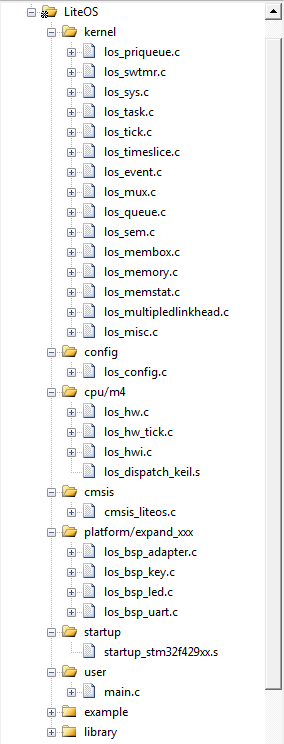

### 6.3 配置工程属性

- 配置target，如果需要调试log输出（printf）到IDE，可以选择Use MicroLib。

- 编译C/C++设置中勾选C99选项

- 配置头文件搜索路径,可参考图片中所示内容

..\..\kernel\base\include;

..\..\kernel\include;

..\..\kernel\config;

..\..\kernel\cmsis;

..\..\kernel\link\keil;

..\..\kernel\cpu\arm\cortex-m4;

..\..\example\include;

..\..\platform\LOS_EXPAND_XXX;

..\..\platform\LOS_EXPAND_XXX_Library;

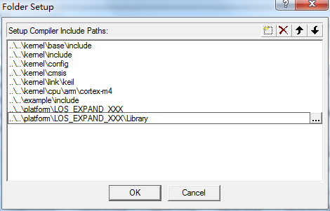

说明：添加kernel\cpu\arm\cortex-m4（或cortex-m3），需要根据实际使用的cpu型号来添加。

- 配置分散加载文件

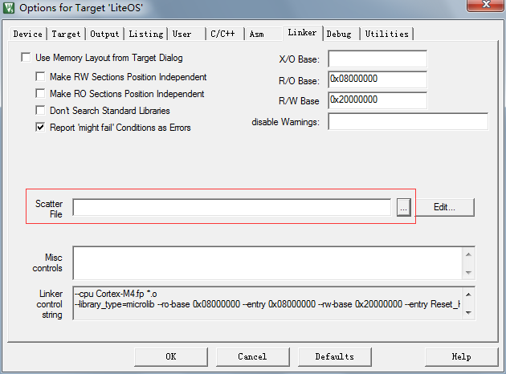

如果您需要使用中断动态注册功能，则需要配套使用分散机制。本示例中未使用分散加载机制，可参考源码中其他工程的分散加载文件自己编写。

其他适配工程中的分散加载文件存放在platform目录下每个开发板自己的文件夹中，比如：\platform\STM32F429I_DISCO\STM32F429I-LiteOS.sct

stm32f429的配置文件内容如下：

说明：分散配置文件中增加的是vector（中断向量表）的内容，LiteOS的中断向量表定义的是0x400大小。如果不了解分散加载文件可以参考IDE的help中有关sct文件的说明，或者baidu、google分散加载文件相关内容。

- 配置debug使用的驱动，比如您使用的是stm32f429zi芯片，则使用选择ST-Link。

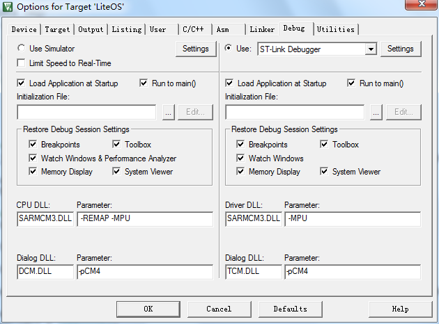

- 如果需要使用printf输出调试log，可以使用软件仿真的方式。

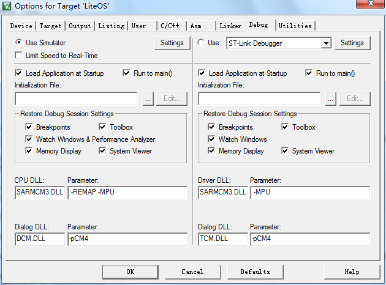

## 7适配驱动代码

如果您不需要适配驱动代码到工程，可忽略此章。

- 内核代码中提供了bsp适配的框架代码，存放在LOS_EXPAND_XXX文件夹下

- 前面已经完成了驱动适配代码及驱动代码的添加(驱动代码可根据您需要使用的具体功能来添加)，祥见下图

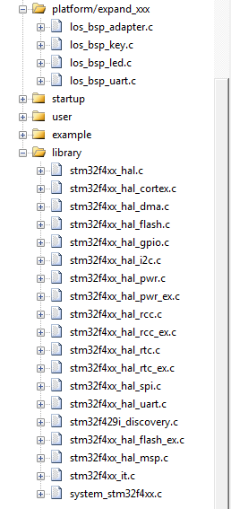

- 根据本地Library代码提供的接口函数，来实现LiteOS中相关的bsp接口函数

（1）修改los_bsp_adapter.c文件，配置系统时钟及SysTick，适配sysTick_Handler函数；

（2）实现los_bsp_led.c、los_bsp_key.c、los_bsp_uart.c等文件中提供的空函数。

- 空函数的具体实现可参考源码中已适配的其他工程中同名的文件，如有其他需要增加的驱动功能，可以在同级目录下添加相关文件。
  
- 将驱动代码添加到内核工程更详细的过程可参考源码doc目录下其他开发板的移植指南文档。

## 8如何验证移植后的工程

如果您需要验证移植后的LiteOS内核功能，可以参考本章内容。

### 8.1 API测试代码使用

- 目前LiteOS提供了单独测试每个功能的api代码，可在main()函数中调用los_demo_entry.c文件中的LOS_Demo_Entry()函数，并放开相应的宏定义。

- 如果需要一次测试内核所有的功能，则可调用los_inspect_entry.c文件中的LOS_Inspect_Entry()函数。

- LiteOS最小需要占用8K的RAM,使用Inspect巡检功能需要再增加1k RAM，不满足此要求的芯片请使用API单项测试功能。

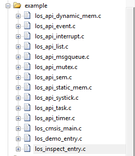 

示例代码如下：

    extern void LOS_Demo_Entry(void)；
    int main(void)
    {
        UINT32 uwRet;
        /*
    		add you hardware init code here
    		for example flash, i2c , system clock ....
        */
    	//HAL_init();....
    	
    	/*Init LiteOS kernel */
        uwRet = LOS_KernelInit();
        if (uwRet != LOS_OK) {
            return LOS_NOK;
        }
    	/* Enable LiteOS system tick interrupt */
        LOS_EnableTick();
    	
        /* 
            Notice: add your code here
            here you can create task for your function 
            do some hw init that need after systemtick init
        */
        LOS_EvbSetup(); 
    
        LOS_Demo_Entry();	
        
        //LOS_Inspect_Entry();
        
    	//LOS_BoadExampleEntry();	
    		
        /* Kernel start to run */
        LOS_Start();
        for (;;);
        /* Replace the dots (...) with your own code.  */
    }

**如何选择测试的功能：**

- 在example\include\los_demo_entry.h 打开要测试的功能的宏开关LOS_KERNEL_TEST_xxx，比如测试task调度打开 LOS_KERNEL_TEST_TASK 即可（//#define LOS_KERNEL_TEST_TASK 修改为 #define LOS_KERNEL_TEST_TASK）

- 中断测试无法在软件仿真的情况下测试, 如需进行中断功能测试，请自行添加中断初始化相关内容到Example_Exti0_Init函数。

**在keil中使用printf打印的方法**

- 将printf重定向到uart输出，需要uart驱动支持，如果没有适配串口驱动代码，则不建议使用该方法。

- 使用软件仿真的方式在keil IDE的debug printf view中查看，将los_demo_debug.h中的LOS_KERNEL_DEBUG_OUT及LOS_KERNEL_TEST_KEIL_SWSIMU宏定义打开（如果是在IAR工程中则不需要打开LOS_KERNEL_TEST_KEIL_SWSIMU）。

### 8.2 编译调试
- 打开工程后，菜单栏Project→Clean Targets、Build target、Rebuild All target files，可编译文件。点击Rebuild All target file，编译全部文件

- 调试运行代码，查看测试结果输出：

(1)如果调用LOS_Demo_Entry()函数进行测试，可根据《HuaweiLiteOSKernelDevGuide》文档中列出每项API功能测试结果来进行对比判断。

(2)如果调用LOS_Inspect_Entry()函数进行功能巡检，gInspectErrCnt值为0则代表移植成功。

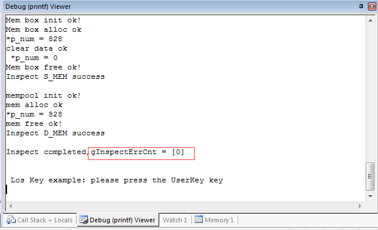

## 9如何使用LiteOS 开发

LiteOS中提供的功能包括如下内容： 任务创建与删除、任务同步（信号量、互斥锁）、动态中断注册机制 等等内容，更详细的内容可以参考“HuaweiLiteOSKernelDevGuide”中描述的相关内容。下面章节将对任务和中断进行说明。

### 9.1 创建任务

- 用户使用LOS_TaskCreate(...)等接口来进行任务的创建。具体可以参考example/api/los_api_task.c中的使用方法来创建管理任务。

### 9.2 中断处理
#### Huawei LiteOS 的中断使用
在驱动开发的过程中我们通常会使用到中断，Huawei LiteOS有一套自己的中断的逻辑，在使用每个中断前需要为其注册相关的中断处理程序。

- OS启动后，RAM起始地址是0x20000000到0x20000400，用来存放中断向量表，系统启动的汇编代码中只将reset功能写入到了对应的区域，系统使用一个全局的m_pstHwiForm[ ]来管理中断。m3以及m4核的前16个异常处理程序都是直接写入m_pstHwiForm[]这个数组的。

- 开发者需要使用某些中断(m3以及m4中非前16个异常)时，可以通过LOS_HwiCreate (…)接口来注册自己的中断处理函数。如果驱动卸载还可以通过LOS_HwiDelete(….)来删除已注册的中断处理函数。系统还提供了LOS_IntLock()关中断及LOS_IntRestore()恢复到中断前状态等接口。详细的使用方法可以参考LiteOS中已经使用的地方。

- LiteOS中断机制会额外地使用2K的RAM，跟大部分开发板bsp代码包中的机制不一样。如果没有动态修改中断处理函数的需要，用户可以选择不使用该中断机制，简单的方法是在los_bsp_adapter.c中将g_use_ram_vect变量设置为0，并且在配置工程时不配置分散加载文件。这样就可以使用demo板bsp包中提供的中断方式。

- 如果使用LiteOS的中断机制，那么在启动LiteOS之前，请先将所有用到的中断都用LOS_HwiCreate()完成注册，否则在完成中断注册前就初始化了相关的硬件以及中断会直接进入osHwiDefaultHandler()导致程序无法正常运行。
- los_bsp_adapter.c中LosAdapIntInit() LosAdapIrpEnable() LosAdapIrqDisable（）等接口都可以调用BSP包中的接口实现。

**关于中断向量位置选择**

- 在los_bsp_adapter.c中，g_use_ram_vect变量控制了LiteOS中是否使用vector向量表（中断向量表）重定向功能。如果g_use_ram_vect设置为 1 ，则需要在配置分散加载文件，如果配置为0，则不配置分散加载文件（即在上面的配置步骤中可以不进行分散加载文件配置），系统启动后默认中断向量表在Rom的0x00000000地址。

###  9.3 系统tick中断配置修改

- los_bsp_adapter.c中修改后的osTickStart()函数，比如在该函数中直接调用BSP包中的接口配置system tick，在stm32中可以调用SysTick_Config(g_ucycle_per_tick);
- 根据实际配置的system clock 修改sys_clk_freq的值，工程中给出的值都是默认时钟频率。比如stm32f429的默认时钟是16M HZ。

### 9.4 LiteOS资源配置

- 对于嵌入式系统来说，内存都是比较宝贵的资源，因此一般的程序都会严格管理内存使用，LiteOS也一样。在LiteOS中系统资源使用g_ucMemStart[OS_SYS_MEM_SIZE]作为内存池，来管理任务、信号量等等资源的创建，总共是32K。而留给用户创建的task的的个数则是LOSCFG_BASE_CORE_TSK_LIMIT（15）.

- LiteOS中的内存使用都是在los_config.h中进行配置的，需要使用多大的内存，可以根据实际的task个数、信号量、互斥锁、timer、消息队列、链表等内容的个数来决定的（根据各自的结构体大小以及个数计算），总的内存池的大小是OS_SYS_MEM_SIZE来定义的。

- LiteOS的中断机制，目前使用了2K的内存。

###  9.5 移植cortex-m3/m4以外其他内核的芯片

- 移植LiteOS到其他内核的芯片时，需要在kernel\cpu下去添加一个芯片所属系列的目录，并且在该新增加的目录下添加los_dispatch，los_hw.c、los_hw_tick、los_hwi这些文件。dispatch文件主要实现task调度相关的处理以及开关中断获取中断号等内容，los_hw.c中实现的task调度时需要保存的寄存器等内容，los_hwi则是中断的相关内容，los_hw_tick则是系统tick中断处理以及获取tick等的实现。

## 其他说明

- 对于RAM较小的芯片，请参照los_config.h文件中的注释，在工程中定义相关的编译宏，否则会出现编译失败（RAM大于32k可不定义）。

		/* default LiteOS ram size level 
			RAM_SIZE_LEVEL_0 means kernel ram < 8k  , 
			RAM_SIZE_LEVEL_1 means kernel ram < 16k, 
			RAM_SIZE_LEVEL_2 means means kernel ram>=32k 
		*/

- 目前在LiteOS的源代码中有一些已经创建好了的工程，移植到新的开发板(芯片)时可参考源码中的这些工程。

- 详细的应用编程API请参考《HuaweiLiteOSKernelDevGuide》。

- FatFs文件系统移植请参考《LiteOS_Migration_Guide_FatFs_Keil.md》。
